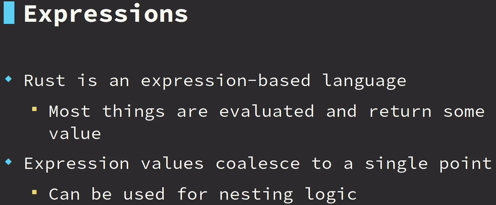

# rust-learn-projects
 $ rustc --version

# cargo init <project_name>
# $ cargo watch -x run
# $ cargo add <package_name>

$ cargo run --bin main
$ cargo run -q --bin <name_of_the_file>
$ cargo check --bin <file.rs>

% To see modules tree
$ cargo install cargo-modules
$ cargo modules generate tree
$ cargo modules generate tree --with-types

